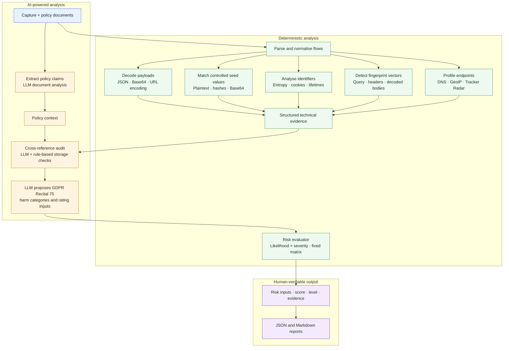

# Beyond the Banner: AI-Powered Network Traffic Analysis for Privacy Risk Detection

`data-flow-analyser` is an open-source, AI-assisted command-line tool for analysing captured HTTP(S) traffic from privacy-testing scenarios. It is designed to support technical privacy assessments and Data Protection Impact Assessments (DPIAs) by making observed data flows easier to inspect, classify, and compare with vendor documentation.

The tool analyses what a service actually sends over the network. It does not replace a privacy expert or make definitive legal determinations. Its output is an evidence-based risk map for human verification.

## Research context

Technical privacy assessments often depend on manual inspection of large mitmproxy or HAR-derived datasets. However, generic network-security tools do not provide enough privacy-specific automation. This project aims to improve the efficiency, reproducibility, and transparency of technical privacy research used in DPIAs.

The central research question is:

> How can an AI-based open-source tool automate the analysis of network traffic data, generated from privacy testing scenarios, to efficiently identify and assess privacy risks within the context of DPIAs?

The current implementation contributes to that question by combining deterministic traffic analysis with LLM-assisted document extraction and cross-referencing. The deterministic stages preserve technical evidence; the LLM is used to interpret structured evidence against policy claims.

## Current capabilities

### Network-flow parsing

- Reads mitmproxy flow-dump files.
- Converts HTTP flows into a common `NetworkFlow` schema.
- Extracts URLs, query paths, request and response headers, request and response bodies, timestamps, status codes, and cookies.
- Recursively decodes JSON, Base64, and URL-encoded payloads where possible.
- Skips unsupported or malformed flows with diagnostic logging.

HAR input is currently recognised but not parsed. The primary supported capture format is a mitmproxy flow dump.

### Personal-data and identifier detection

Optional seed values can be supplied through a JSON file. For each seed, the analyser generates plaintext, case variants, MD5, SHA-1, SHA-256, and Base64 lookup values. It scans URLs, request headers, request bodies, and sent cookies for matches.

The seed values are useful for controlled privacy-testing scenarios. For example, a test email address or account identifier entered during a browser interaction. Raw matched values should be treated as sensitive evidence.

The analyser also calculates Shannon character entropy for candidate strings. Values that are at least eight characters long and meet the default entropy threshold of `3.5` are reported as possible dynamic identifiers. Generic HTTP negotiation headers such as `Accept` and `Accept-Language` are excluded because their values can score highly without being identifiers. Repeated findings are aggregated with occurrence counts. Entropy is a heuristic, meaning a high score does not prove that a value is personal data or a tracker.

### Endpoint profiling

For each observed host, the tool can:

- Resolve the hostname to an IP address.
- Perform reverse-DNS lookup.
- Look up country and ASN/organisation metadata.
- Check the DuckDuckGo Tracker Radar, including parent-domain suffix matches.
- Record tracker category, parent entity, third-country-transfer indicators, and lookup results.

Network and external lookup failures are retained as diagnostic events rather than silently treated as confirmed facts.

### Cookies and storage

The storage profiler inventories observed cookie names from sent and set cookies, then compares them with storage items extracted from the supplied policy documents. It reports:

- Documented cookies.
- Undocumented cookies.
- Cookies with excessive lifetimes.
- Observed lifespan and matching policy declarations.

Cookies with a parsed lifetime longer than 90 days are flagged by the rule-based analyser. This is an analytical threshold, not a legal conclusion.

### Browser and device fingerprinting candidates

The analyser looks for bundled fingerprinting attributes across:

- URL query parameters.
- Selected request headers and client hints, such as `User-Agent`, `Accept-Language`, viewport, device-memory, and `Sec-CH-UA-*` headers.
- Recursively decoded JSON and form-like request bodies.

The current taxonomy includes display, locale/time, hardware/OS, canvas, audio, WebGL, and system-capability signals. A request becomes a fingerprinting candidate when it bundles multiple relevant categories, with additional weight for canvas, audio, or WebGL signals.

This is an explainable attribute-co-occurrence heuristic. It does not claim a measured number of uniqueness bits because that requires an external population-frequency baseline. The current version also does not generate synthetic browser variations or run browser automation.

### Consent-phase analysis

Consent metadata is optional because not every capture contains pre-consent, consented, and withdrawn phases. When timestamps are supplied, flows are assigned to phases using their capture timestamps:

- `pre_consent`
- `consented`
- `withdrawn`
- `unknown`

If timestamps are omitted, the tool does **not** assume that consent was denied. All flows remain `unknown` for consent-phase analysis.

Identical fingerprint candidates observed in consented and withdrawn phases are reported as persistence findings. Missing phase data is reported as unknown; it is not treated as proof of compliance or non-compliance.

### Policy analysis and LLM cross-referencing

The document ingestor sends the complete aggregated policy/DPA text by default to an LLM and extracts:

- Declared personal-data categories.
- Declared subprocessors.
- Declared cookies and storage mechanisms.
- International-transfer mechanisms.
- Retention statements.

The cross-referencer then receives structured policy claims together with observed endpoints, seed matches, entropy candidates, cookie results, and fingerprint evidence. It produces endpoint classifications, storage classifications, and discrepancy cards with reasoning and policy citations where available.

### Indicative risk evaluation

Discrepancy risk is evaluated using a deterministic likelihood-and-severity method informed by GDPR Recital 75 and based on the [Information Commissioner's Office (UK ICO) DPIA method](https://ico.org.uk/for-organisations/uk-gdpr-guidance-and-resources/accountability-and-governance/data-protection-impact-assessments-dpias/how-do-we-do-a-dpia#how10). The LLM identifies relevant potential harms and provides the factual basis for two inputs; the application calculates the score and indicative level. This prevents the LLM from freely choosing the final risk category.

The harm assessment considers physical, material, and non-material damage, including:

- Discrimination, identity theft or fraud, and financial loss.
- Reputational damage and loss of confidentiality.
- Unauthorised reversal of pseudonymisation.
- Significant economic or social disadvantage.
- Loss of control over personal data or inability to exercise rights.
- Special-category data and criminal-conviction data.
- Profiling of personal aspects such as interests, behaviour, health, economic situation, location, or movements.
- Data concerning vulnerable people, particularly children.
- Large-scale processing affecting many data subjects.

Likelihood and severity use three levels:

| Score | Likelihood of harm | Severity of impact |
| ---: | --- | --- |
| 1 | Remote | Minimal impact |
| 2 | Reasonable possibility | Some impact |
| 3 | More likely than not | Serious harm |

The risk score is `likelihood × severity`. The indicative matrix is:

| Likelihood \\ Severity | 1 | 2 | 3 |
| --- | --- | --- | --- |
| 1 | Low | Low | Low |
| 2 | Low | Medium | High |
| 3 | Low | High | High |

These levels are indications for human review, not definitive legal conclusions. The Markdown and JSON reports include the inputs, score, indicative level, potential harms, assessment basis, and a human-verification flag.

### Debugging

With `--verbose`, the exact system and user prompts sent to both LLM calls are written to the console. With `--log-file`, they can be retained for reproducibility. Because these prompts can contain complete policy documents and traffic-derived values, log files must be protected as sensitive research data.

## Installation

The project requires Python 3.10 or newer.

```bash
python -m venv .venv
source .venv/bin/activate
pip install -e .
```

The package uses LiteLLM for model access. Configure the provider credentials expected by LiteLLM in `.env`, or provide `--api-key` and optionally `--api-base` on the command line.

## Usage

Check that the installation is available:

```bash
data-flow-analyser healthcheck
```

Run an audit with one or more policy documents, for example:

```bash
data-flow-analyser audit \
  --capture scenarios.flows \
  --doc dpa.txt \
  --doc cookies.rst \
  --out-json audit.json \
  --out-md audit.md
```

Add controlled seed values from a JSON file:

```json
{
  "email": "research-user@example.org",
  "account_id": "test-account-123"
}
```

```bash
data-flow-analyser audit \
  --capture scenarios.flows \
  --doc dpa.txt \
  --seed-file seed.json
```

Provide consent-event timestamps when the capture contains those phases. Timestamps must be ISO-8601 and include a timezone:

```bash
data-flow-analyser audit \
  --capture scenarios.flows \
  --doc dpa.txt \
  --consent-granted-at "2026-06-28T10:15:00+02:00" \
  --consent-withdrawn-at "2026-06-2810:40:00+02:00"
```

Use verbose diagnostics to inspect every major processing stage and the exact LLM inputs:

```bash
data-flow-analyser audit \
  --capture scenarios.flows \
  --doc dpa.txt \
  --verbose \
  --log-file audit-debug.log
```

Available output formats are JSON and Markdown. If neither `--out-json` nor `--out-md` is supplied, the Markdown report is printed to the terminal.

## Processing pipeline



## Development and testing

Run the test suite from the project virtual environment:

```bash
.venv/bin/python -m pytest -q
```

The test suite covers decoding, entropy and cookie-lifetime analysis, seed matching, endpoint profiling, document ingestion, cross-referencing, pipeline execution, fingerprint-vector/consent-phase analysis, and the deterministic ICO-style risk evaluator.

For reproducible research, retain the capture file, policy-document versions, seed-file version, consent timestamps, model/provider configuration, verbose logfile, and generated JSON report together. External endpoint metadata should also be treated as time-dependent evidence.

## Project structure

```text
src/data_flow_analyser/
├── cli.py                         Command-line interface
├── pipeline.py                    End-to-end orchestration
├── models/schemas.py              Shared evidence and report schemas
├── parsers/
│   ├── mitm_parser.py              mitmproxy flow parsing
│   └── decoder.py                  Recursive payload decoding
├── engines/
│   ├── endpoint_profiler.py        DNS, GeoIP, ASN, and tracker metadata
│   ├── fingerprint_profiler.py     Fingerprint vector detection
│   ├── entropy.py                  Entropy and cookie-lifetime analysis
│   ├── seed_hasher.py              Controlled-value matching
│   ├── storage_profiler.py         Cookie/policy reconciliation
│   ├── document_ingestor.py        LLM policy extraction
│   └── cross_referencer.py         LLM evidence cross-reference
└── exporter.py                     JSON and Markdown reports
```

## License and research use

This project is licensed under the [Apache License, Version 2.0](LICENSE). See [NOTICE](NOTICE) for the attribution notice.

The project is intended as an open-source research and assessment aid. Before analysing real traffic, confirm that the capture, policy documents, seed values, and any third-party lookups may be processed in the environment. Generated reports and verbose log files may contain personal, confidential, or security-sensitive information and should be handled accordingly.
