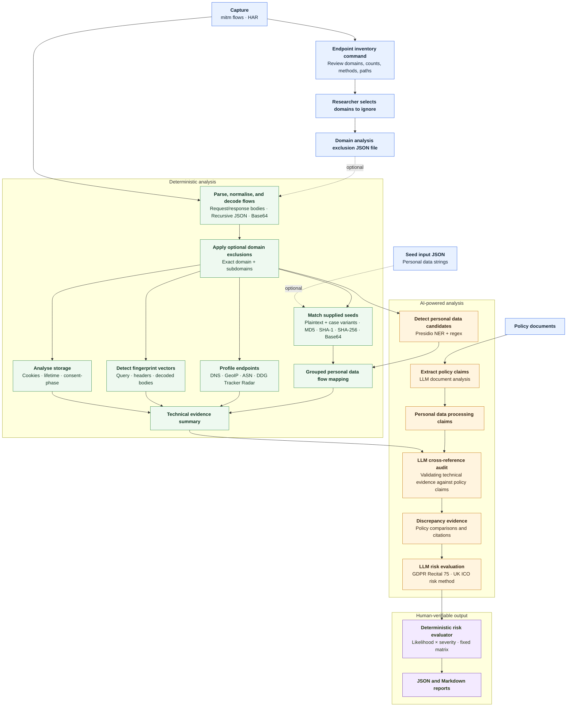

# Beyond the Banner: AI-Powered Network Traffic Analysis for Privacy Risk Detection

`data-flow-analyser` is an open-source, AI-powered command-line tool for analysing captured HTTP(S) traffic from privacy-testing scenarios. It is designed to support technical privacy assessments and Data Protection Impact Assessments (DPIAs) by making observed data flows easier to inspect, classify, and compare with vendor documentation.

The tool analyses what a service actually sends over the network. It does not replace a privacy expert or make definitive legal determinations. Its output is an evidence-based risk map for human verification.

## Research context

Technical privacy assessments often depend on manual inspection of large mitmproxy or HAR-derived datasets. However, generic network-security tools do not provide enough privacy-specific automation. This project aims to improve the efficiency, reproducibility, and transparency of technical privacy research used in DPIAs.

The central research question is:

> How can an AI-based open-source tool automate the analysis of network traffic data, generated from privacy testing scenarios, to efficiently identify and assess privacy risks within the context of DPIAs?

The current implementation contributes to that question by combining deterministic traffic analysis with Large Language Model (LLM) powered document extraction + cross-referencing and Named Entity Recognition (NER) personal data identification. The deterministic stages preserve technical evidence; the LLM is used to interpret structured evidence against policy claims. The tool is fully self-serving: feed it the necessary data, and an entire report rolls out, subject to human evaluation.

## Current capabilities

### Network-flow parsing

- Reads mitmproxy flow-dump files and HAR files.
- Converts HAR entries to temporary mitmproxy flows automatically, so HAR captures use the same analysis path and do not create sidecar files.
- Converts HTTP flows into a common `NetworkFlow` schema.
- Extracts URLs, query paths, request and response headers, request and response bodies, timestamps, status codes, and cookies.
- Recursively decodes JSON, Base64, and URL-encoded payloads where possible.
- Skips unsupported or malformed flows with diagnostic logging.

### Personal data flow and identifier detection

Identifying which data is sent to which endpoint helps reviewers connect observed technical behaviour to privacy risks, policy claims, and possible international transfers. The deterministic detectors preserve the underlying traffic evidence, while the AI-powered stages help organise and compare that evidence with the supplied policy documents.

#### Seed matching
Optional seed values can be supplied through a JSON file. For each seed, the analyser generates plaintext, case variants, MD5, SHA-1, SHA-256, and Base64 lookup values. It scans request and response URLs, headers, bodies, and cookies, including recursively decoded JSON, URL-encoded, and Base64-wrapped payloads.

The seed values are useful for controlled privacy testing scenarios. For example, a test email address or account identifier entered during a browser interaction. Raw matched values should be treated as sensitive evidence. Matches are grouped by endpoint, direction, payload location, data label, and detection method. The JSON report retains occurrence counts, matched values, and source flow IDs for reproduction; the LLM and Markdown report receive/show the compact grouped evidence.

#### Named Entity Recognition and Regular Expression matching
When installed, the optional Presidio integration discovers the available Presidio recognisers dynamically instead of using a short hard-coded entity list. It scans global entity types such as names, email addresses, phone numbers, locations, dates, IP addresses, URLs, MAC addresses, crypto wallets, IBANs, and credit cards, together with configured European country-specific recognisers. The European profile includes the Netherlands (`NL`) alongside the UK, Spain, Italy, Poland, Finland, Sweden, Germany, and Turkey; Presidio may not provide a built-in recogniser for every country. Non-European country-specific recognisers are excluded by default.

Presidio results are candidates rather than proof. For performance, very large network flows use a separate deterministic-only Presidio analyser without spaCy NER. Use `--presidio-full-ner` to use the full NER on all values, but note that these can be substantially slower.

If Presidio or its spaCy model is unavailable, the seed-based pipeline continues and records an analysis warning.

### Endpoint profiling

For each observed host, the tool can:

- Resolve the hostname to an IP address.
- Perform reverse-DNS lookup.
- Look up country and ASN/organisation metadata.
- Check the DuckDuckGo Tracker Radar, including parent-domain suffix matches.
- Record tracker category, parent entity, third-country-transfer indicators, and lookup results.

Network and external lookup failures are retained as diagnostic events rather than silently treated as confirmed facts.

### Cookies and storage

The storage profiler inventories observed cookie names from sent and set cookies, then compares them with storage items extracted from the supplied policy documents. It reports:

- Documented cookies.
- Undocumented cookies.
- Observed lifespan and matching policy declarations.
- The network hosts where each cookie was observed being set or sent.
- The optional `Domain=` attribute declared in `Set-Cookie` headers.
- The exact timestamp and first consent phase in which each cookie was observed, when consent timestamps are supplied.

### Browser and device fingerprinting candidates

The analyser looks for bundled fingerprinting attributes across:

- URL query parameters.
- Selected request headers and client hints, such as `User-Agent`, `Accept-Language`, viewport, device-memory, and `Sec-CH-UA-*` headers.
- Recursively decoded JSON and form-like request bodies.

The current taxonomy includes display, locale/time, hardware/OS, canvas, audio, WebGL, and system-capability signals. A request becomes a fingerprinting candidate when it bundles multiple relevant categories:

- Four or more distinct categories; or
- At least two categories, including one high-signal category: canvas, audio, or WebGL.

The candidate rule is intentionally conservative and explainable. A single `User-Agent` or screen-size value is common in ordinary browser traffic and is not enough on its own. A combination of several browser/device properties is more consistent with a fingerprinting vector, while canvas, audio, and WebGL receive additional weight because they can expose rendering or hardware-specific characteristics.

Each vector also receives a heuristic score between `0.0` and `1.0`:

```text
score = min((0.1 × number_of_categories) +
            (0.2 × number_of_high_signal_categories), 1.0)
```

The score is an evidence-strength indicator for this heuristic, not a probability that fingerprinting occurred and not a measure of browser uniqueness. For example, five observed categories with one high-signal category produce a score of `0.7` (`0.5 + 0.2`). A score of `1.0` means that the heuristic reached its reporting cap; it does not mean 100% certainty.

This analyser does not estimate how rare a fingerprint is in the wider browser population. A population-frequency baseline would require an external dataset containing the prevalence of values such as screen sizes, WebGL renderers, languages, and device capabilities. The current score therefore measures the quantity and type of observed categories only. The analyser also does not generate synthetic browser variations or run browser automation.

### Consent-phase analysis

Consent metadata is optional because not every capture contains pre-decision, post-decision, and withdrawn phases. When timestamps are supplied, flows are assigned to phases using their capture timestamps. `--consent-decided-at` records when the cookie-banner choice was made; it does not mean that all cookies were accepted. The default outcome is `necessary_only`, meaning that only strictly necessary or functional cookies were accepted. `non_essential_granted` represents a full-consent test in which optional categories were also accepted:

- `pre_consent`
- `post_decision_necessary_only`
- `full_consent`
- `withdrawn`
- `unknown`

If timestamps are omitted, the tool does not assume that a consent choice was made. All flows remain `unknown` for consent-phase analysis.

Identical fingerprint candidates observed before the decision, after the necessary-only choice, or across full-consent and withdrawn phases are reported as consent-phase findings. Missing phase data is reported as unknown; it is not treated as proof of compliance or non-compliance.

### Policy analysis and LLM cross-referencing

The document ingestor sends the complete aggregated policy/DPA text by default to an LLM and extracts:

- Declared personal data categories.
- Declared subprocessors.
- Declared cookies and storage mechanisms.
- International-transfer mechanisms.
- Retention statements.

The cross-referencer then receives structured policy claims together with observed endpoints, grouped personal data flow mappings, cookie results, and fingerprint evidence. It produces endpoint classifications, storage classifications, and discrepancy cards with reasoning and policy citations where available.

### Indicative risk evaluation

Discrepancy risk is evaluated using a deterministic likelihood-and-severity method informed by GDPR Recital 75 and based on the [Information Commissioner's Office (UK ICO) DPIA method](https://ico.org.uk/for-organisations/uk-gdpr-guidance-and-resources/accountability-and-governance/data-protection-impact-assessments-dpias/how-do-we-do-a-dpia#how10). The LLM identifies relevant potential harms and provides the factual basis for two inputs; the application calculates the score and indicative level. This prevents the LLM from freely choosing the final risk category.

The harm assessment considers physical, material, and non-material damage, including:

- Discrimination, identity theft or fraud, and financial loss.
- Reputational damage and loss of confidentiality.
- Unauthorised reversal of pseudonymisation.
- Significant economic or social disadvantage.
- Loss of control over personal data or inability to exercise rights.
- Special-category data and criminal-conviction data.
- Profiling of personal aspects such as interests, behaviour, health, economic situation, location, or movements.
- Data concerning vulnerable people, particularly children.
- Large-scale processing affecting many data subjects.

Likelihood and severity use three levels:

| Score | Likelihood of harm | Severity of impact |
| ---: | --- | --- |
| 1 | Remote | Minimal impact |
| 2 | Reasonable possibility | Some impact |
| 3 | More likely than not | Serious harm |

The risk score is `likelihood × severity`. The indicative matrix is:

| Likelihood \\ Severity | 1 | 2 | 3 |
| --- | --- | --- | --- |
| 1 | Low | Low | Low |
| 2 | Low | Medium | High |
| 3 | Low | High | High |

These levels are indications for human review, not definitive legal conclusions. The Markdown and JSON reports include the inputs, score, indicative level, potential harms, assessment basis, and a human-verification flag.

LLM classifications are validated after parsing. Unknown classifications, omitted observed endpoints, invalid evidence references, deterministic storage overrides, and incomplete risk inputs are recorded as report warnings. Evidence references may identify flow IDs, observed endpoint domains or IPs, grouped personal data mappings, observed storage items, or fingerprint vectors. A report with such warnings has `analysis_status: partial`; an execution or parsing failure has `analysis_status: failed`.

### Reproducibility

Every JSON report records the tool version, model, temperature, analysis timestamps, reference time, and SHA-256 hashes of the capture, policy documents, and seed data. Seed data are hashed rather than copied into provenance metadata. Cookie expiry calculations use the flow timestamp or the recorded analysis reference time; when neither is available, an absolute `Expires` directive is reported as having unknown lifespan instead of using the current wall-clock time.

For research runs, retain the capture, policy-document versions, seed-file version, generated JSON report, generated Markdown report, and verbose log together. External DNS, GeoIP, reverse-DNS, and Tracker Radar results remain time-dependent; use cached or locally snapshotted metadata when exact replay is required.

### Debugging

With `--verbose`, the exact system and user prompts sent to both LLM calls are written to the console and retained in the automatically generated `audit-YYYYMMDD-HHMMSS.log` file. Use `--log-file` to choose an explicit log path. Because these prompts can contain complete policy documents and traffic-derived values, log files must be protected as sensitive research data.

## Installation

The project requires Python 3.10 or newer.

```bash
python -m venv .venv
source .venv/bin/activate
pip install -e .
```

For seed-independent personal data detection, install the spaCy model matching the language you want to analyse. For Dutch:

```bash
python -m spacy download nl_core_news_lg
```

See the [spaCy model documentation](https://spacy.io/models/nl) for model details.

The core pipeline remains usable without the model. Presidio findings are then skipped and reported as an analysis warning. The CLI defaults to English (`--presidio-language en`); use a matching spaCy model and language option for supported European languages such as Dutch (`nl`), German (`de`), Spanish (`es`), Italian (`it`), or French (`fr`).

Supported models:
- en_core_web_lg
- nl_core_news_lg
- de_core_news_lg
- es_core_news_lg
- it_core_news_lg
- fr_core_news_lg

The package uses LiteLLM for model access. Configure the provider credentials expected by LiteLLM in `.env`, or provide `--api-key` and optionally `--api-base` on the command line.

## Usage

### Check the installation

Check that the installation is available:

```bash
data-flow-analyser healthcheck
```

### Use the local web interface

For a simple way to run the audit, start the local browser interface:

```bash
data-flow-analyser web
```

Then open the printed `http://127.0.0.1:8765` address. You can first select one or more captures and click **Gather endpoint evidence** to run the deterministic equivalent of `data-flow-analyser endpoints`; the browser shows the inventory and provides JSON/Markdown downloads. For a full audit, select one or more captures and one or more disclosure documents, choose the consent outcome, and optionally enter the decision and withdrawal timestamps. Multiple captures are analysed in selection order as one combined capture. The timestamp timezone defaults to the browser's local timezone but can be selected explicitly. Seed input and excluded domains each support either pasted JSON (the default) or a small JSON file upload. The form also exposes the CLI's model, temperature, API key/base, Presidio language/full-NER, verbose, seed JSON, and excluded-domain JSON settings. The API key is optional: when left blank, the web run uses the environment or `.env` credentials available to LiteLLM. Presidio has an explicit **Disabled** option; otherwise English is selected by default. The results page shows the generated Markdown and provides downloads for the Markdown report, JSON report, and diagnostic log. The interface runs locally and uploads are kept in a temporary run directory.

### Use the command line interface

Repeat `--capture` (or `-c`) to supply multiple flow or HAR files; they are analysed in the order provided as one combined capture.

#### Review endpoints before an audit

Before an audit, use the deterministic endpoint inventory command to review every host in a capture. It does not call an LLM or enrich domains over the network:

```bash
data-flow-analyser endpoints \
  --capture scenarios.flows \
  --out-json endpoints.json \
  --out-md endpoints.md
```

The inventory includes flow counts, methods, paths, and first/last observation times. Use it to create an optional exclusion file for browser, Mozilla, extension, or other researcher-identified traffic:

The command displays the endpoint table in the terminal and writes both JSON and Markdown inventories. Use `--out-json` and/or `--out-md` to choose explicit paths. If omitted, both files are written to the current directory as `endpoints-YYYYMMDD-HHMMSS.json` and `endpoints-YYYYMMDD-HHMMSS.md`.

```json
{
  "domains": [
    "mozilla.org",
    "bitwarden.com"
  ]
}
```

Pass that file to `audit` with `--exclude-file`. Matching is case-insensitive and excludes the listed domain plus all of its subdomains. Excluded flows are removed immediately after parsing, before endpoint profiling, seed matching, cookie analysis, fingerprint analysis, or LLM cross-referencing. Without `--exclude-file`, no flows are excluded.

```bash
data-flow-analyser audit \
  --capture scenarios.flows \
  --doc dpa.txt \
  --exclude-file excluded-domains.json
```

#### Run an audit

Run an audit with one or more policy documents, for example:

```bash
data-flow-analyser audit \
  --capture scenarios.flows \
  --doc dpa.txt \
  --doc cookies.rst \
  --out-json audit.json \
  --out-md audit.md
```

#### Match controlled test values

Add controlled seed values from a JSON file:

```json
{
  "email": "research-user@example.org",
  "account_id": "test-account-123"
}
```

```bash
data-flow-analyser audit \
  --capture scenarios.flows \
  --doc dpa.txt \
  --seed-file seed.json
```

#### Control reproducibility

The LLM temperature can be set explicitly for a run:

```bash
data-flow-analyser audit \
  --capture scenarios.flows \
  --doc dpa.txt \
  --temperature 0
```

#### Analyse consent phases

Provide the timestamp of the cookie-banner choice when the capture contains a consent decision. Timestamps must be ISO-8601 and include a timezone. For the standard privacy test, use `necessary_only` and omit the withdrawal timestamp:

```bash
data-flow-analyser audit \
  --capture scenarios.flows \
  --doc dpa.txt \
  --consent-decided-at "2026-06-28T10:15:00+02:00" \
  --consent-outcome necessary_only
```

For a separate full-consent and withdrawal scenario, use:

```bash
data-flow-analyser audit \
  --capture scenarios.flows \
  --doc dpa.txt \
  --consent-decided-at "2026-06-28T10:15:00+02:00" \
  --consent-outcome non_essential_granted \
  --consent-withdrawn-at "2026-06-28T10:40:00+02:00"
```

#### Enable diagnostics

Use verbose diagnostics to inspect every major processing stage and the exact LLM inputs:

```bash
data-flow-analyser audit \
  --capture scenarios.flows \
  --doc dpa.txt \
  --verbose \
  --log-file audit-debug.log
```

#### Tune Presidio processing scope

The depth of processing by Presidio can be configured. More depth equals higher chances of finding personal data candidates in flow traces.

`--presidio-responses-only` skips request headers, query parameters, and bodies while retaining sent cookies as compact, useful identifiers.
`--presidio-skip-known-file-types` skips payloads identified as common binary or media formats using their URL extension or `Content-Type` (for example ZIP, JPG, PNG, PDF, audio, and video).
`--presidio-full-ner` applies spaCy NER to all flow traces. By default, Presidio uses fast deterministic recognisers for big traces.

```bash
data-flow-analyser audit \
  --capture scenarios.flows \
  --doc dpa.txt \
  --presidio-responses-only \
  --presidio-skip-known-file-types
```

#### Understand the reports

Every audit writes both a JSON report and a Markdown report, and prints the Markdown report to the terminal. Use `--out-json` and/or `--out-md` to choose explicit output paths. If omitted, both files are written to the current directory as `audit-YYYYMMDD-HHMMSS.json` and `audit-YYYYMMDD-HHMMSS.md`.

Every audit also writes diagnostics to `audit-YYYYMMDD-HHMMSS.log` in the current directory. Use `--log-file` to choose an explicit path; use `--verbose` when the log should include the full pipeline trace and exact LLM prompts.

## Processing pipeline



## Development and testing

Run the test suite from the project virtual environment:

```bash
.venv/bin/python -m pytest -q
```

For reproducible research, retain the capture file, policy-document versions, seed-file version, consent timestamps, model/provider configuration, verbose logfile, and generated JSON report together. External endpoint metadata should also be treated as time-dependent evidence.

## Project structure

```text
src/data_flow_analyser/
├── cli.py                         Command-line interface and logging setup
├── web.py                         Web interface for endpoint extraction and audit
├── endpoint_inventory.py          Domain exclusion and endpoint helpers
├── exporter.py                    JSON and Markdown report generation
├── pipeline.py                    End-to-end orchestration
├── models/
│   ├── __init__.py
│   └── schemas.py                 Shared flow, evidence, and report schemas
├── parsers/
│   ├── __init__.py
│   ├── har_converter.py            HAR-to-mitmproxy conversion
│   ├── mitm_parser.py              mitmproxy flow and HAR parsing
│   └── decoder.py                  Recursive payload decoding
├── engines/
│   ├── __init__.py
│   ├── consent.py                  Consent-phase classification for analysers
│   ├── cookie_analysis.py          Cookie-lifetime analysis
│   ├── cross_referencer.py         LLM evidence cross-reference and parsing
│   ├── document_ingestor.py        LLM policy extraction
│   ├── endpoint_profiler.py        DNS, GeoIP, ASN, and Tracker Radar metadata
│   ├── fingerprint_profiler.py     Fingerprint vector and consent-phase analysis
│   ├── presidio_detector.py        Seed-independent PII candidate detection
│   ├── risk_evaluator.py           Deterministic likelihood/severity scoring
│   ├── seed_hasher.py              Controlled-value and encoded/hash matching
│   └── storage_profiler.py         Deterministic cookie/policy reconciliation
└── __init__.py                     Package metadata
```

## License and research use

This project is licensed under the [Apache License, Version 2.0](LICENSE). See [NOTICE](NOTICE) for the attribution notice.

The project is intended as an open-source research and assessment aid. Before analysing real traffic, confirm that the capture, policy documents, seed values, and any third-party lookups may be processed in the environment. Generated reports and verbose log files may contain personal, confidential, or security-sensitive information and should be handled accordingly.
